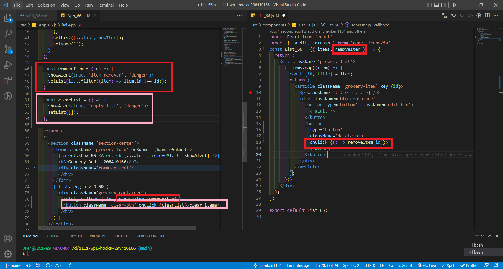

### W06-P1: Use DevTools to exam useState values

### W06-P2: Show <Alert_66 /> and <List_66 />

### W06-P3: Using localStorage to save list data

### W06-p4: Add function for removing item and clearing list

